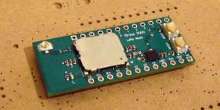

# Rhino WAN
  
Rhino WAN is a derivative of Grasshopper, an Arduino for LoRaWAN. This design removes the pattern antenna for legal use in certain areas.  
Module: CMWX1ZZABZ-078  
EDA/CAD: CircuitStudio 1.5.2  
